# Tutorial de Instalação — Mapa do Eixo

Este tutorial instala o sistema **Mapa do Eixo** numa planilha vazia. O sistema atende várias áreas do hospital (Eixo, UTI, internamentos, estabilização) — cada área vive na sua própria planilha. A instalação é a mesma para todas: muda apenas **dois** dos arquivos (o config e a interface da área). Ao final, a planilha vai ter um menu próprio (`📋 GERAR MAPA`) com a criação de mapas funcionando.

A instalação é feita uma única vez por área. Depois, o uso é só pelo menu. Para instalar outra área, repita este tutorial numa nova planilha.

---

## Antes de começar

**Pré-requisitos:**

- Conta Google ativa, com acesso ao Google Drive e Planilhas
- Computador (não funciona bem pelo celular — alguns passos não estão disponíveis no app móvel)
- Acesso aos arquivos de código do projeto (são 8 por área: 6 comuns a todas + o config e a interface da sua área)

**Tempo estimado:** 10 minutos, sem pressa.

**Se algo der errado:** não se preocupe em "consertar" — anote em que passo aconteceu, tire um print da tela se conseguir, e fale com o Igor.

---

## Escolha a área (faça isto primeiro)

O sistema é o mesmo para todas as áreas; o que muda por área são **dois arquivos**: o `config` (estrutura e regras daquela área) e a `interface` (que define se a área tem turno Diurno/Noturno ou um mapa por dia).

Localize a sua área na tabela e anote o nome do **config** e da **interface** — você vai usá-los no Passo 3, e o menu gerado será o da última coluna.

| Área                     | config                  | interface               | menu gerado            |
| ------------------------ | ----------------------- | ----------------------- | ---------------------- |
| Eixo                     | `config_eixo`           | `interface_turno_duplo` | ☀️ Diurno / 🌙 Noturno |
| UTI                      | `config_uti`            | `interface_turno_duplo` | ☀️ Diurno / 🌙 Noturno |
| Estabilização Pediátrica | `config_estab_ped`      | `interface_turno_duplo` | ☀️ Diurno / 🌙 Noturno |
| Internamento Clínico     | `config_int_clinico`    | `interface_turno_unico` | 📅 Criar mapa do dia   |
| Internamento Pediátrico  | `config_int_pediatrico` | `interface_turno_unico` | 📅 Criar mapa do dia   |
| Internamento Cirúrgico   | `config_int_cirurgico`  | `interface_turno_unico` | 📅 Criar mapa do dia   |

> **Turno duplo × turno único:** áreas de turno duplo geram duas planilhas por dia (Diurno e Noturno); áreas de turno único geram uma planilha por dia. O resto da instalação é idêntico.

---

## Visão geral

O que vamos fazer, em ordem:

1. Criar uma planilha em branco no Google Drive
2. Abrir o editor de scripts (Apps Script) dessa planilha
3. Criar os 8 arquivos no editor (6 comuns + os 2 da sua área) e colar o código de cada um
4. Atualizar a lista de fisioterapeutas com os CREFITOs reais
5. Autorizar permissões e rodar o setup inicial
6. Validar que o menu apareceu na planilha
7. Compartilhar a planilha com a equipe

---

## Passo 1 — Criar a planilha

1. Abra o Google Drive ([drive.google.com](https://drive.google.com)).
2. Clique no botão **+ Novo** (canto superior esquerdo) → **Planilhas Google** → **Planilha em branco**.
3. Uma nova aba do navegador vai abrir com uma planilha sem nome.
4. Clique no título "Planilha sem título" (canto superior esquerdo) e renomeie incluindo a sua área, por exemplo:
   ```
   Mapa - <Área> - Hospital Jessé Fontes
   ```
   (ex.: `Mapa - Internamento Clínico - Hospital Jessé Fontes`)
5. **Não feche essa aba.** Vamos voltar para ela ao final.

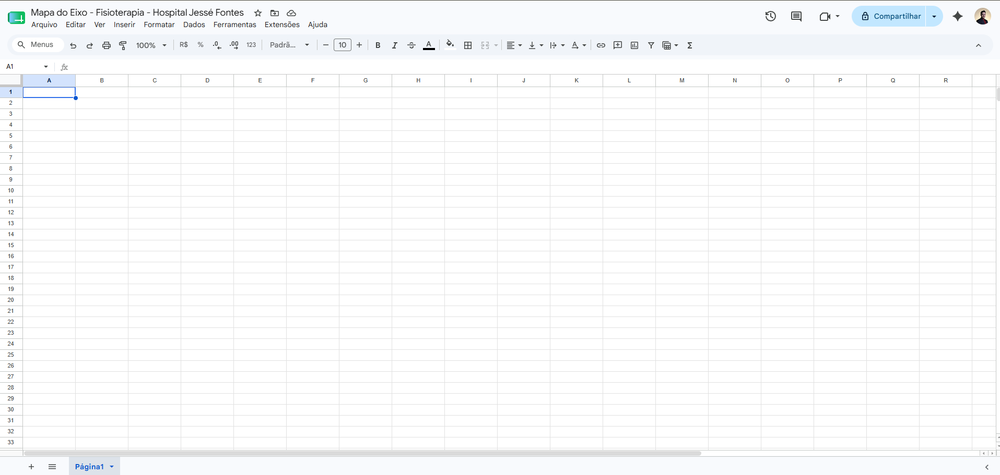

✅ Ao fim deste passo: você tem uma planilha em branco aberta no navegador, com o nome correto.

---

## Passo 2 — Abrir o editor de scripts

Aqui é onde a maior parte do trabalho acontece. O **Apps Script** é um editor de código que vive dentro do Google — é separado da planilha, mas conectado a ela.

1. Na planilha que você acabou de criar, no menu superior, clique em **Extensões** → **Apps Script**.

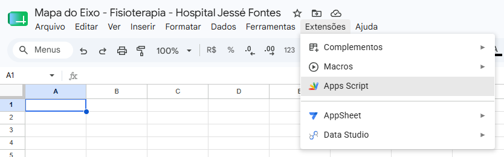

2. Uma **nova aba** do navegador vai abrir mostrando o editor de scripts.
3. No editor, você vai ver:
   - Do lado esquerdo: uma lista chamada **Arquivos**, com um arquivo padrão chamado `Código.gs`.
   - No centro: o conteúdo desse arquivo, que tem só uma função vazia `myFunction()`.
   - No topo: o nome do projeto, que está como "Projeto sem título".

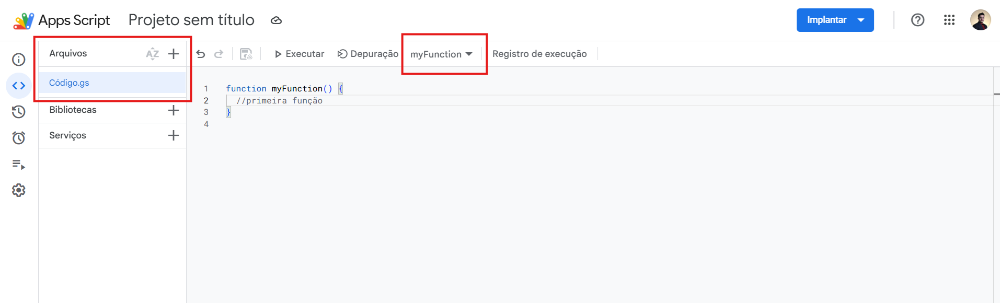

4. Clique no nome **"Projeto sem título"** (no topo) e renomeie para `Mapa - <Área>` (ex.: `Mapa - Internamento Clínico`). Confirme.

✅ Ao fim deste passo: editor aberto numa aba separada, projeto renomeado.

---

## Passo 3 — Criar os 8 arquivos de código

Esta é a parte mais demorada. Vamos criar 8 arquivos no editor, um de cada vez, copiando o conteúdo de cada um do repositório. Seis são comuns a todas as áreas; dois são da sua área (o config e a interface da tabela de "Escolha a área").

### 3.1. Apagar o arquivo padrão

1. Na lista **Arquivos** do lado esquerdo, passe o mouse sobre `Código.gs`.
2. Clique nos **três pontinhos** que aparecem do lado direito do nome.
3. Escolha **Excluir**. Confirme.

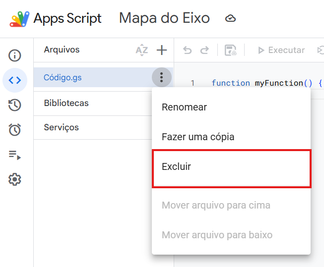

### 3.2. Criar cada arquivo

Você vai criar 8 arquivos com estes nomes exatos (sem o `.gs` — o editor adiciona sozinho). Os dois marcados com ← dependem da sua área (veja a tabela em "Escolha a área"):

1. `config_<área>` ← config da sua área
2. `fisioterapeutas`
3. `utils`
4. `util_padronizacao`
5. `modelo_geral`
6. `pacientes`
7. `turnos`
8. `interface_turno_<modo>` ← interface da sua área (`_duplo` ou `_unico`)

Para **cada um** dos 8 arquivos, repita estes passos:

1. No lado esquerdo, ao lado de **Arquivos**, clique no botão **+** (símbolo de mais).
2. Escolha **Script** (não escolha HTML).
3. Digite o nome exato do arquivo (ex: `config_int_clinico`) e pressione **Enter**.
4. Um novo arquivo abre no centro, com um esqueleto de função vazia.
5. **Selecione tudo** (Ctrl+A no Windows / Cmd+A no Mac) e **apague** (Delete).
6. Vá ao repositório / pasta do Drive, abra o arquivo correspondente (ex: `config_int_clinico.gs`), e **copie todo o conteúdo** (Ctrl+A → Ctrl+C).
7. Volte ao editor do Apps Script e **cole** no arquivo vazio (Ctrl+V).
8. Salve com **Ctrl+S** (ou Cmd+S no Mac). Você deve ver uma confirmação rápida no topo.

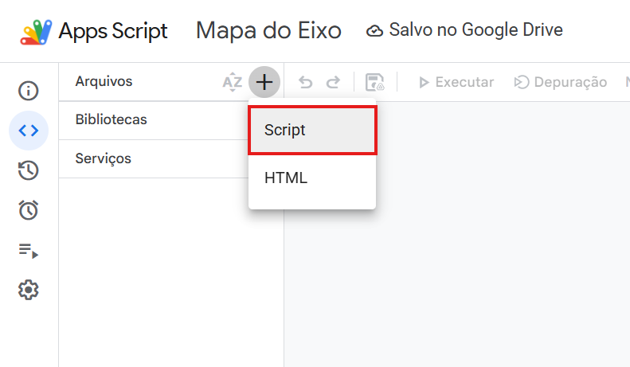

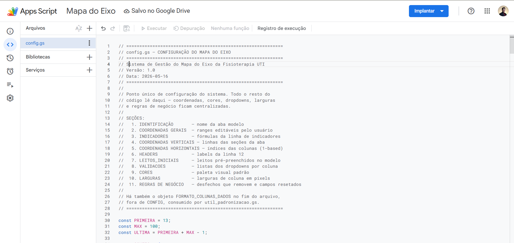

### 3.3. Validação intermediária

Quando terminar os 8 arquivos, a lista de **Arquivos** no lado esquerdo deve mostrar exatamente isto — substituindo o config e a interface pelos nomes da sua área:

```
config_<área>.gs            (ex.: config_int_clinico.gs)
fisioterapeutas.gs
utils.gs
util_padronizacao.gs
modelo_geral.gs
pacientes.gs
turnos.gs
interface_turno_<modo>.gs   (ex.: interface_turno_unico.gs)
```

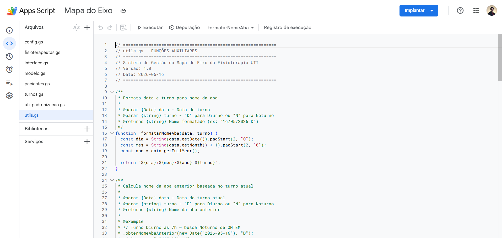

> **Atenção:** os nomes precisam ser **exatamente** esses. Se você digitou `Config` (com C maiúsculo) ou `fisioterapeuta` (sem o "s"), o sistema pode não funcionar. Confira também que você criou **o config e a interface da sua área** (não os de outra área) — é o erro mais comum. Caso veja qualquer diferença, clique nos três pontinhos do arquivo, escolha **Renomear** e corrija.

> **Nunca coloque dois configs ou duas interfaces no mesmo projeto.** Cada planilha leva exatamente um config e uma interface. Misturar arquivos de áreas diferentes quebra o sistema de forma silenciosa.

✅ Ao fim deste passo: os 8 arquivos estão criados, preenchidos com o código correspondente, e salvos.

---

## Passo 4 — Atualizar os CREFITOs

Esta é a única customização necessária. O arquivo `fisioterapeutas.gs` tem os números de CREFITO como `SE123456` e `SE654321` — são valores **falsos**, só para o código rodar. Você precisa substituir pelos números reais.

1. Na lista de arquivos, clique em `fisioterapeutas.gs`.
2. Você vai ver algo parecido com:
   ```javascript
   const FISIOTERAPEUTAS = [
     "Igor Araújo Santos Trindade - CREFITO SE123456",
     "Davyd Alysson Carvalho Lopes - CREFITO SE654321",
   ];
   ```
3. Substitua `SE123456` pelo CREFITO real do Igor e `SE654321` pelo seu.
4. **Não mexa nas aspas, vírgulas, ou em qualquer outra parte da linha.** Só troque o número.
5. Salve com **Ctrl+S**.

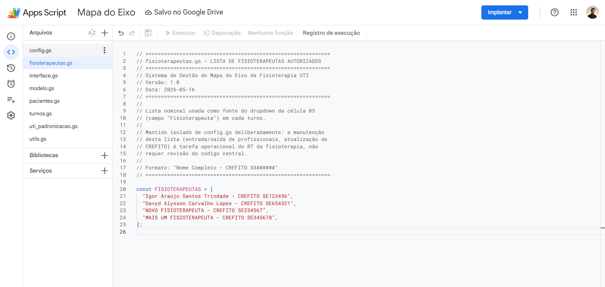

✅ Ao fim deste passo: os CREFITOs reais estão no arquivo, salvos.

---

## Passo 5 — Autorizar permissões e rodar o setup

Agora vamos rodar a função que cria a estrutura visual do Mapa na planilha. Na primeira execução, o Google vai pedir permissões — é normal.

### 5.1. Selecionar a função

1. Na **barra superior** do editor (acima do código), há um menu suspenso (dropdown) com nome de função. Por padrão pode estar mostrando alguma função qualquer.
2. Clique nesse dropdown e procure por **`_criarAbaModelo`** (vai estar no meio da lista). Selecione.

### 5.2. Executar

3. Clique no botão **Executar** (▶), ao lado do dropdown.
4. Vai aparecer uma janela: **"Autorização necessária"** — clique em **Revisar permissões**.

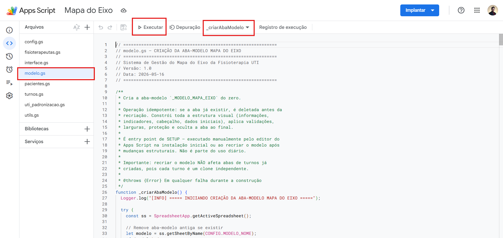

### 5.3. Autorizar (primeira vez apenas)

5. Uma nova janela do Google abre pedindo para escolher a conta. Escolha sua conta Google (a mesma da planilha).
6. Pode aparecer uma tela amarela/laranja com o aviso **"Google não verificou este app"**. Isso é esperado — não estamos publicando o app, é uso pessoal.
   - Clique em **Avançado** (link pequeno no canto inferior).
   - Clique em **Acessar Mapa - <Área> (não seguro)** (o nome que você deu ao projeto no Passo 2).

   > Esse "não seguro" assusta mas significa apenas que o app não passou por revisão pública do Google — o que faz sentido, já que é um script interno da sua equipe. Você está autorizando seu próprio script a usar suas próprias planilhas.

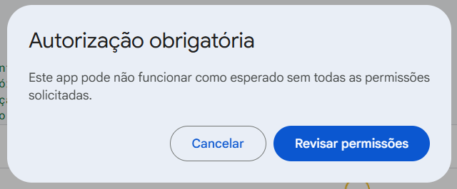

7. Na tela seguinte, o Google mostra a lista de permissões que o script precisa:
   - **Ver, editar, criar e excluir todas as suas planilhas do Google Drive**
   - **Exibir e executar conteúdo de terceiros em planilhas...**

   Clique em **Permitir**.

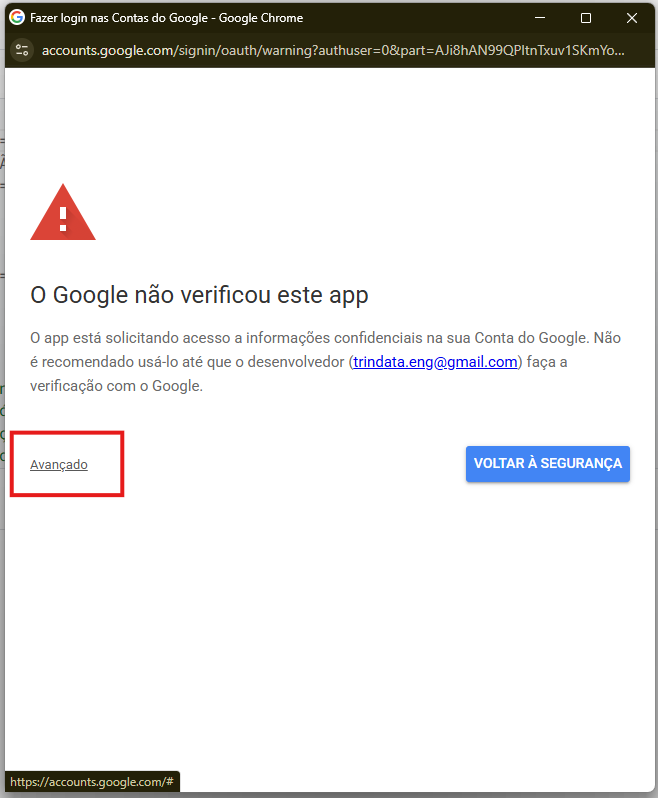
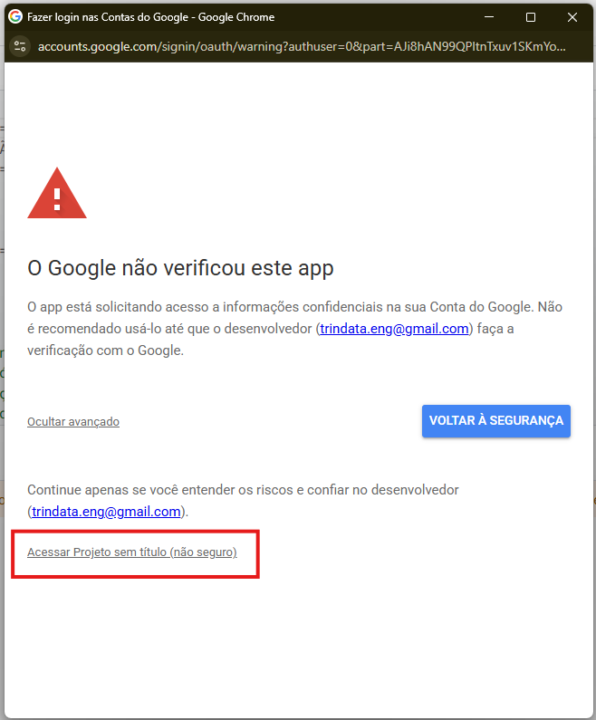
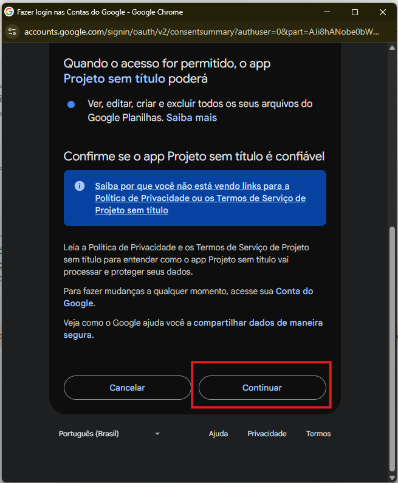

### 5.4. Aguardar execução

8. A janela de autorização fecha e a função começa a rodar. Você vê uma barra cinza no rodapé com **"Em execução..."**.
9. Em alguns segundos, vai aparecer **"Execução concluída"**.

10. Abaixo do editor há uma área chamada **Registro de execução** (ou **Logs**). Role essa área para baixo — a última linha deve ser:
    ```
    [OK] ✅ Aba-modelo criada com sucesso!
    ```

> **Se aparecer erro vermelho:** anote a mensagem exata, tire print do registro de execução e mande para o Igor.

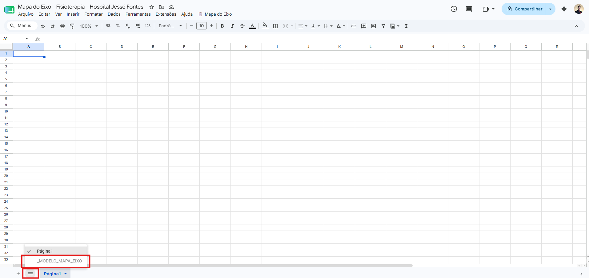

✅ Ao fim deste passo: o script está autorizado e a aba-modelo foi criada (mas ela é oculta, então você não vai vê-la na planilha ainda).

---

## Passo 6 — Validar o menu na planilha

1. Volte para a aba do navegador onde está a **planilha** (não o editor).
2. **Recarregue a página** (F5 ou Ctrl+R).
3. Aguarde a planilha terminar de carregar.
4. Na barra de menus superior, ao lado de **Ajuda**, deve aparecer um novo item:

   ```
   📋 GERAR MAPA
   ```

5. Clique nele. As opções dependem da sua área (veja a tabela em "Escolha a área"):
   - **Áreas de turno duplo (Eixo, UTI):**
     - ☀️ Criar turno DIURNO
     - 🌙 Criar turno NOTURNO
   - **Áreas de turno único (internamentos, estabilização):**
     - 📅 Criar mapa do dia

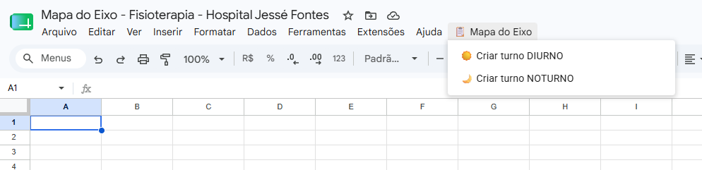

### Teste rápido

6. Para confirmar que tudo está funcionando, clique na opção de criação da sua área (**☀️ Criar turno DIURNO** no turno duplo, ou **📅 Criar mapa do dia** no turno único).
7. Uma caixa pergunta pela data — deixe em branco e clique **OK** (usa a data de hoje).
8. Outra caixa pergunta se quer criar em branco (já que não existe planilha anterior na primeira vez) — clique **Sim**.
9. Confirmação final — clique **Sim**.
10. Em alguns segundos, uma nova aba aparece na parte inferior da planilha com o nome `DD/MM/AAAA D`, mostrando o mapa pronto para uso.

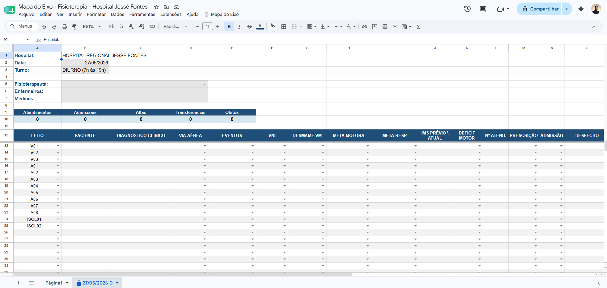

✅ Ao fim deste passo: o sistema está instalado e funcionando.

> **Opcional:** depois de validar, você pode deletar a aba de teste clicando com o botão direito no nome da aba (rodapé) → **Excluir**.

---

## Passo 7 — Compartilhar a planilha com a equipe

Agora que o sistema funciona, libere o acesso para quem vai usar.

1. Na planilha, clique no botão **Compartilhar** (azul, canto superior direito).
2. No campo de e-mail, adicione os e-mails das pessoas autorizadas a editar (fisioterapeutas, enfermagem, médicos — conforme o protocolo da unidade).
3. Para cada pessoa, escolha a permissão **Editor**.
4. Clique em **Enviar**.

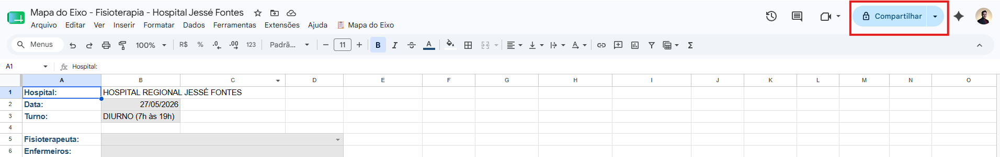
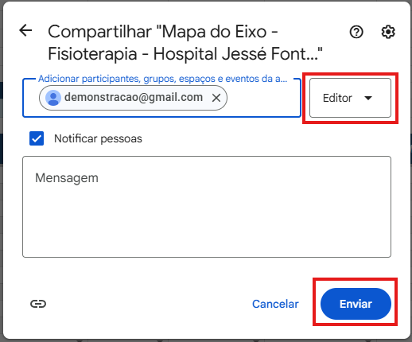

> **Importante:** o sistema foi projetado para até **2 editores ativos ao mesmo tempo**. Adicionar mais pessoas com permissão de Editor não é problema — só evite que mais de 2 estejam criando mapas simultaneamente (sobretudo na virada de turno), para não dar conflito.

✅ Ao fim deste passo: a equipe tem acesso e o sistema está pronto para uso diário.

---

## Resolução de problemas

### O menu `📋 GERAR MAPA` não aparece na planilha

- Verifique se você **salvou** todos os arquivos no editor (Ctrl+S em cada).
- **Recarregue** a planilha (F5). O menu só aparece após o reload, não automaticamente após salvar.
- Se mesmo assim não aparecer, abra novamente **Extensões → Apps Script**, verifique se os 8 arquivos ainda estão lá com os nomes corretos (incluindo o config e a interface da sua área).

### Erro ao executar `_criarAbaModelo`

- Verifique se os 8 arquivos foram criados com os nomes **exatos** listados no passo 3.
- Confirme que há **apenas um** config e **apenas uma** interface no projeto (nunca os de duas áreas juntos).
- Verifique se você colou o **conteúdo inteiro** de cada arquivo (às vezes a cópia falha).
- Tire print do erro no registro de execução e envie para o Igor.

### Tela "Google não verificou este app" não tem opção "Avançado"

- Acontece em algumas contas Google corporativas que bloqueiam scripts não verificados.
- Tente usar uma conta Google pessoal (Gmail comum) para a instalação inicial.
- Se não for possível, fale com o Igor para uma alternativa.

### O mapa foi criado mas está sem leitos ou sem formatação

- Provavelmente o arquivo `config_<área>.gs` ou `modelo_geral.gs` foi colado incompleto.
- Vá no editor, abra o `config_<área>.gs`, role até o fim e veja se termina com `};`.
- Se não terminar, refaça a cópia desse arquivo e rode `_criarAbaModelo` novamente.

### As faixas amarelas de enfermaria não apareceram (áreas de internamento)

- Isso é uma questão do config da área, não da instalação. Refaça a cópia do `config_<área>.gs` (inteiro) e rode `_criarAbaModelo` de novo.
- Se persistir, tire print e fale com o Igor.

### Outro problema

Tire print da tela e do registro de execução do Apps Script, anote em qual passo aconteceu, e envie para o Igor.

---

## Pronto!

A instalação está completa. Para o uso diário, basta usar o menu **📋 GERAR MAPA** na planilha — não precisa voltar no editor de scripts.

A documentação técnica do sistema fica nos arquivos `README.md` e `REFERENCIA.md` do repositório.
