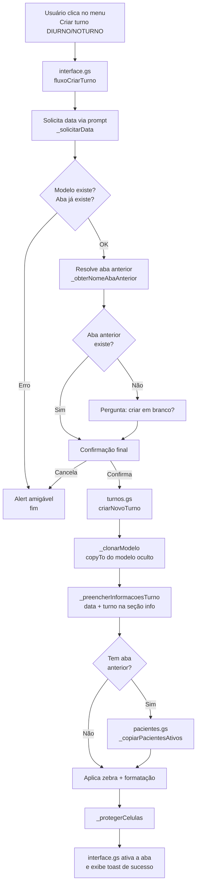

# Mapa do Eixo

Sistema de gestão de turnos da fisioterapia da UTI do Hospital Regional Jessé Fontes. Cada turno (Diurno 7h / Noturno 19h) gera uma aba do Google Sheets contendo o estado clínico dos pacientes ativos: via aérea, eventos do turno, metas terapêuticas, desfecho e avaliação diária. Pacientes ativos são copiados automaticamente do turno anterior; pacientes com alta, óbito ou transferência saem da lista.

A criação automática de cada aba é feita pelo usuário através de um menu na própria planilha.

---

## Mapa dos arquivos

O código vive todo em Google Apps Script vinculado à planilha. Oito arquivos `.gs`:

| Arquivo                | Responsabilidade                                                            |
| ---------------------- | --------------------------------------------------------------------------- |
| `config.gs`            | Constantes centrais: coordenadas, cores, dropdowns, regras de negócio       |
| `fisioterapeutas.gs`   | Lista nominal de fisioterapeutas (isolado para manutenção fácil)            |
| `modelo.gs`            | Construção da aba-modelo `_MODELO_MAPA_EIXO` (executado no setup)           |
| `turnos.gs`            | Núcleo puro de criação de turnos — sem UI, recebe parâmetros e executa      |
| `pacientes.gs`         | Cópia inteligente de pacientes ativos entre turnos (match por leito)        |
| `interface.gs`         | Camada de UI: menu, prompts, alerts, toasts; orquestra o fluxo              |
| `utils.gs`             | Auxiliares de domínio: nome de aba, data, zebra, preenchimento de cabeçalho |
| `util_padronizacao.gs` | Auxiliares de formatação genérica (alinhamento, wrap, largura)              |

Dependências em uma frase: `interface.gs` chama `turnos.gs`, que clona o modelo criado por `modelo.gs`, copia pacientes via `pacientes.gs`, e usa `utils.gs` + `util_padronizacao.gs` para formatação. Todos leem `config.gs` e `fisioterapeutas.gs`.

---

## Fluxo de criação de turno

O núcleo (`turnos.gs`, `pacientes.gs`) não conhece UI: lança `Error` em qualquer falha. A camada `interface.gs` faz o `try/catch` e traduz para alert amigável.

---

## Setup inicial

Pré-requisitos: a planilha já deve estar criada e compartilhada com quem for operar (até 2 editores simultâneos por design).

**1. Instalar o código.**
Abrir a planilha → menu **Extensões → Apps Script** → criar os 8 arquivos com o conteúdo de `src/`. Salvar o projeto.

**2. Atualizar a lista de fisioterapeutas.**
Editar `fisioterapeutas.gs` com o nome + CREFITO de cada profissional autorizado. Esta lista alimenta o dropdown da seção de informações de cada turno.

**3. Criar a aba-modelo.**
No editor do Apps Script, selecionar a função `_criarAbaModelo` no dropdown superior e executar. Autorizar as permissões solicitadas na primeira execução (acesso à planilha em nome do usuário). Ao terminar, a planilha terá uma aba oculta chamada `_MODELO_MAPA_EIXO`.

Esta etapa só precisa ser refeita se a estrutura visual do modelo mudar (novas colunas, novos dropdowns, novas regras). Não é parte do uso diário.

**4. Recarregar a planilha.**
Após o primeiro save do código, fechar e reabrir a planilha. O `onOpen` adiciona o menu `📋 Mapa do Eixo` com os itens **☀️ Criar turno DIURNO** e **🌙 Criar turno NOTURNO**.

A partir daqui, o uso é só pelo menu.

---

## Permissões exigidas

Na primeira execução o Google solicita autorização para:

- Ler e modificar planilhas do usuário (necessário para criar abas, escrever dados, aplicar formatação)
- Exibir caixas de diálogo no Sheets (necessário para prompts e alerts da camada de interface)

Não há acesso a Drive externo, Gmail, ou qualquer serviço fora da planilha em que o script está vinculado.

---

## Limites operacionais

- **Concorrência:** até 2 editores simultâneos. Acima disso, conflitos de escrita podem ocorrer durante a criação de turno.
- **Capacidade:** `MAX = 100` linhas de dados por turno (configurável em `config.gs`). Cobre 13 leitos fixos + extras com folga ampla.
- **Quotas do Apps Script:** execução individual limitada a 6 minutos. A criação de um turno típico leva poucos segundos; não há risco prático de timeout no fluxo atual.

---

## Próximas leituras

- `REFERENCIA.md` — glossário de domínio, estrutura física da aba, semântica das 16 colunas, regras de transição entre turnos, entry points e pegadinhas técnicas.
- JSDoc inline nos arquivos `.gs` — contrato de cada função pública.
