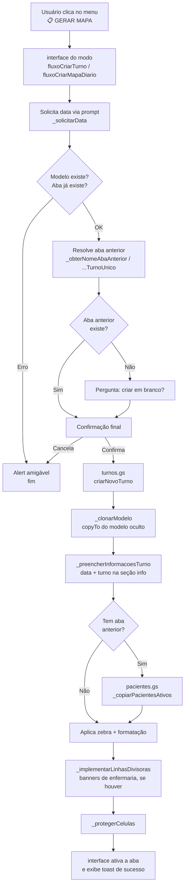

# Mapa do Eixo

Sistema de gestão de mapas clínicos das unidades do Hospital Regional Jessé Fontes. Cada planilha gera abas do Google Sheets contendo o estado clínico dos pacientes ativos: via aérea, eventos, metas terapêuticas, desfecho e avaliação diária. Pacientes ativos são copiados automaticamente da aba anterior; pacientes com alta, óbito ou transferência saem da lista.

É um sistema **multiárea**: o mesmo código atende várias unidades (Eixo, UTI, internamentos, estabilização), cada uma na sua planilha. Há dois modos de operação:

- **Turno duplo** (Eixo, UTI): duas abas por dia — Diurno (7h) e Noturno (19h).
- **Turno único** (internamentos, estabilização): uma aba por dia (o mapa do dia).

A criação de cada aba é feita pelo usuário através de um menu na própria planilha.

---

## Arquitetura multiárea

Cada área é um projeto Apps Script independente, numa planilha própria, montado com: **os arquivos compartilhados + um config da área + uma interface do modo**.

> **Regra dura:** um projeto leva exatamente um config, uma interface e um modelo. Nunca dois de cada no mesmo projeto — o Apps Script tem namespace global único e a segunda definição sobrescreve a primeira em silêncio. A coexistência dos modos é só no repositório.

| Área                     | config                  | interface               | modo  |
| ------------------------ | ----------------------- | ----------------------- | ----- |
| Eixo                     | `config_eixo`           | `interface_turno_duplo` | duplo |
| UTI                      | `config_uti`            | `interface_turno_duplo` | duplo |
| Estabilização Pediátrica | `config_estab_ped`      | `interface_turno_unico` | único |
| Internamento Clínico     | `config_int_clinico`    | `interface_turno_unico` | único |
| Internamento Pediátrico  | `config_int_pediatrico` | `interface_turno_unico` | único |
| Internamento Cirúrgico   | `config_int_cirurgico`  | `interface_turno_unico` | único |

---

## Mapa dos arquivos

Todo o código é Google Apps Script vinculado à planilha. Os arquivos se dividem em **compartilhados** (iguais em toda área) e **selecionáveis** (um config e uma interface por projeto).

### Compartilhados

| Arquivo                | Responsabilidade                                                                                                                |
| ---------------------- | ------------------------------------------------------------------------------------------------------------------------------- |
| `modelo_geral.gs`      | Construção da aba-modelo `_MODELO_MAPA` (validações com guards por coluna, larguras, banners de enfermaria); executado no setup |
| `turnos.gs`            | Núcleo da criação; recebe parâmetros já resolvidos e executa a lógica principal                                                 |
| `pacientes.gs`         | Cópia inteligente de pacientes ativos entre abas (match por leito)                                                              |
| `utils.gs`             | Utilitários de domínio: datas, nomes de aba, zebra, e cálculo da aba anterior (duplo e único)                                   |
| `util_padronizacao.gs` | Auxiliares genéricos de formatação (wrap, alinhamento e largura)                                                                |
| `fisioterapeutas.gs`   | Lista nominal de fisioterapeutas, isolada para facilitar manutenção                                                             |

### Selecionáveis (um de cada por projeto)

| Arquivo                    | Responsabilidade                                                              |
| -------------------------- | ----------------------------------------------------------------------------- |
| `config_<área>.gs`         | Constantes da área: coordenadas, colunas, cores, dropdowns, leitos e regras   |
| `interface_turno_duplo.gs` | Camada de UI do modo duplo (menu Diurno/Noturno, prompts, alerts, fluxo)      |
| `interface_turno_unico.gs` | Camada de UI do modo único (menu "Criar mapa do dia", prompts, alerts, fluxo) |

### Fluxo de dependências

Em termos de fluxo:

- a **interface** (`interface_turno_duplo` ou `interface_turno_unico`) coordena as ações do usuário;
- `turnos.gs` executa a criação das abas;
- `modelo_geral.gs` fornece a estrutura-base utilizada na clonagem;
- `pacientes.gs` replica pacientes ativos entre abas;
- `utils.gs` e `util_padronizacao.gs` aplicam regras auxiliares e formatação;
- o **config da área** e `fisioterapeutas.gs` funcionam como fontes compartilhadas de configuração e dados.

> **Observação:** o arquivo `testes.gs` é apenas um artefato de desenvolvimento utilizado para experimentação e validação local. Sua presença ou ausência não altera o comportamento funcional do sistema em produção.

---

## Fluxo de criação de aba

O fluxo é o mesmo nos dois modos; muda apenas a interface de entrada e a função que resolve a aba anterior.

O núcleo (`turnos.gs`, `pacientes.gs`, `modelo_geral.gs`) não conhece UI: lança `Error` em qualquer falha. A interface faz o `try/catch` e traduz para alert amigável.

---

## Setup inicial

> O passo a passo detalhado, com prints, está em `INSTALACAO.md`. O resumo abaixo é para quem já conhece o Apps Script.

Pré-requisitos: a planilha já deve estar criada e compartilhada com quem for operar.

**1. Instalar o código.**
Abrir a planilha → menu **Extensões → Apps Script** → criar os arquivos: os 6 compartilhados + o `config` da área + a `interface` do modo (veja a tabela de "Arquitetura multiárea"). Salvar o projeto.

**2. Atualizar a lista de fisioterapeutas.**
Editar `fisioterapeutas.gs` com o nome + CREFITO de cada profissional autorizado. Esta lista alimenta o dropdown da seção de informações.

**3. Criar a aba-modelo.**
No editor do Apps Script, selecionar a função `_criarAbaModelo` no dropdown superior e executar. Autorizar as permissões solicitadas na primeira execução. Ao terminar, a planilha terá uma aba oculta chamada `_MODELO_MAPA`.

Esta etapa só precisa ser refeita se a estrutura visual do modelo mudar (novas colunas, novos dropdowns, novas regras). Não é parte do uso diário.

**4. Recarregar a planilha.**
Após o primeiro save do código, fechar e reabrir a planilha. O `onOpen` adiciona o menu `📋 GERAR MAPA` com as opções do modo:

- **Duplo:** ☀️ Criar turno DIURNO e 🌙 Criar turno NOTURNO.
- **Único:** 📅 Criar mapa do dia.

A partir daqui, o uso é só pelo menu.

---

## Permissões exigidas

Na primeira execução o Google solicita autorização para:

- Ler e modificar planilhas do usuário (necessário para criar abas, escrever dados, aplicar formatação)
- Exibir caixas de diálogo no Sheets (necessário para prompts e alerts da camada de interface)

Não há acesso a Drive externo, Gmail, ou qualquer serviço fora da planilha em que o script está vinculado.

---

## Limites operacionais

- **Concorrência:** até 2 editores simultâneos. Acima disso, conflitos de escrita podem ocorrer durante a criação de aba. (Mais relevante no modo duplo, na virada de turno.)
- **Capacidade:** `MAX = 100` linhas de dados por aba (configurável em `config_<área>.gs`). Cobre os leitos fixos da área + extras com folga ampla.
- **Quotas do Apps Script:** execução individual limitada a 6 minutos. A criação de uma aba típica leva poucos segundos; não há risco prático de timeout no fluxo atual.

---

## Próximas leituras

- `INSTALACAO.md` — tutorial passo a passo de instalação de uma área, com prints.
- `MANUAL.md` — manual de uso diário para a equipe assistencial.
- `REFERENCIA.md` — arquitetura multiárea, glossário, estrutura física da aba, colunas, indicadores, regras de transição entre abas, linhas divisoras, entry points e pegadinhas técnicas.
- JSDoc inline nos arquivos `.gs` — contrato de cada função pública.
